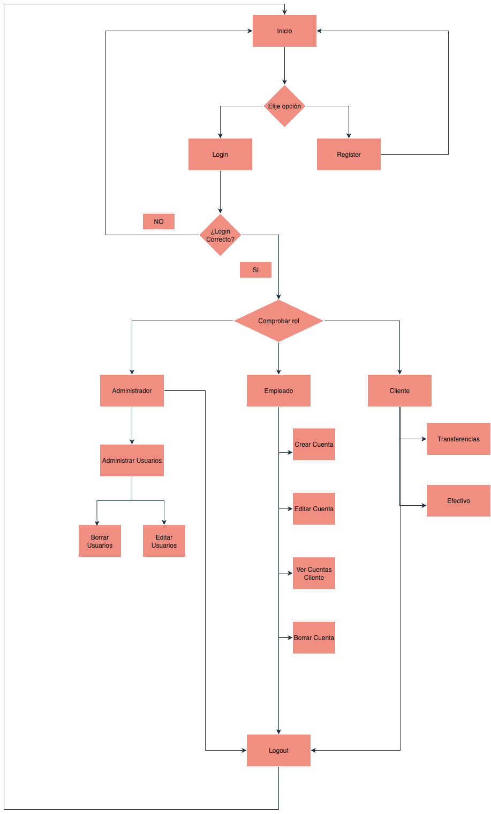

# Documentación Técnica

## Arquitectura Interna
<!-- Explicación de rutas, modelos y flujos -->

### Diagrama de flujo




## Configuración y Conexión con MongoDB
<!-- Instrucciones para crear la base de datos y conectar la app -->

- La app provee al usuario final de una cuenta en MongoDB para gestionar la Base de Datos.
- Los datos de configuración y acceso a la BBDD estarán incluidos en las variables de entorno.
- Cuando la app arranca por primera vez: 
    - Se crea la BBDD con las colecciones (tablas) necesarias.
    - Se crea un usuario administrador para poder acceder la APP con privilegios, cuya contraseña se encripta.

## Endpoints
| Ruta                          |Método             |Parámetros                     |Respuesta          |Descripción                            |
|-------------------------------|-------------------|-------------------------------|-------------------|---------------------------------------|
| /                             |GET/POST           | -                             |HTML               | Login/Register                        |
| /dashboard_cliente            |GET                | dni                           |HTML               | Landing page para clientes            |
| /transferencias/<dni>         |GET/POST           | dni,origen,destino,monto      |HTML               | Mostrar transferencias de un cliente  |
| /efectivo                     |GET/POST           | dni,origen,monto              |HTML               | Ingreso/retirada de efectivo          |
| /dashboard_admin              |GET                | dni                           |HTML               | Landing page para administradores     |
| /admin_users/<user>/edit      |GET/POST           | dni,nombre,apellidos,rol      |HTML               | Actualizar datos y/o rol de usuarios  |
| /admin_users/<user>/delete    |POST               | dni                           |HTML               | Borrar usuario de la BD               |
| /dashboard_empleado           |GET                | dni                           |HTML               | Landing page para empleados           |
| /cuentas_cliente/<cliente>    |GET                | dni                           |HTML               | Obtener cuentas del cliente           |
| /crear_cuenta/<dni>           |POST               | dni                           |HTML               | Crear una cuenta para el cliente      |
| /editar_cuenta/<id_cuenta>    |GET/POST           | dni,id_cuenta                 |HTML               | Cambiar titular de la cuenta y datos  |
| /borrar_cuenta/<id_cuenta>    |POST               | dni,id_cuenta                 |HTML               | Eliminar cuenta del usuario           |
| /logout                       |GET/POST           | -                             |HTML               | Cerrar sesión del usuario             |

## Fragmentos de Código de Ejemplo
```python
# Ruta al dashboard del cliente una vez inicia la sesión
@app.route('/dashboard_cliente')
def dashboard_cliente():    
   
    if 'username' in session and session.get('rol') == 'cliente':
        dni = session.get('dni')

        # Sacar nombre y apellidos desde la lista de usuarios

        lista_usuarios = bd.lista_usuarios(usuarios_col)

        for usuario in lista_usuarios:
            if usuario['dni'] == dni:
                nombre = usuario['nombre']
                apellidos = usuario['apellidos']

        cuentas_cliente = []
        saldo_total = 0.0

        cuentas = bd.lista_cuentas(cuentas_col)

        for cuenta in cuentas:
            if cuenta['dni_titular'] == dni:
                cuentas_cliente.append(cuenta)
                saldo_total += float(cuenta['saldo'])
                saldo_total = round(saldo_total,2)

        return render_template('usuario/dashboard_cliente.html',nombre=nombre,apellidos=apellidos,cuentas_cliente=cuentas_cliente,num_cuentas=len(cuentas_cliente),saldo_total=saldo_total)
    
    else:
        flash('Acceso no autorizado')
        return redirect(url_for('logout'))
```

## Notas Técnicas
<!-- Comentarios HTML y aclaraciones técnicas -->

<!---   - Se ha implementado un sistema de encriptación de contraseñas, las cuales se almacenan ya encriptadas en la BBDD
        - La encriptación y desencriptado de contraseñas se realizan mediante hash de 256 bits
        - Cuando se introducen registros en la BBDD se hacen las comprobaciones pertinentes para que no haya duplicidades
        - Dado que MongoDB es muy laxa en la asignación de Primary Key y Foreign Key, se han implementado métodos para permitir dichas operaciones
        - Dentro de las comprobaciones de los datos,se tienen en cuenta los posibles errores a la hora de introducir los tipos de datos necesario
        - La elección de una clase llamada Base de datos es fundamental para facilitar las operaciones con la misma
>

## Referencias
<!-- Enlaces internos y externos relevantes -->
